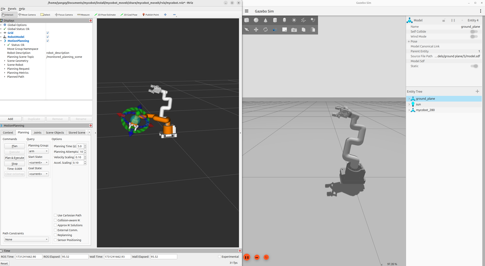

# Environment
- Ubuntu 24.04
- ROS Jazzy
- Gazebo Harmonic
- MoveIt 2（ros-jazzy-moveit）

# Introduction
This repository implements joint calls between ROS Jazzy Gazebo Harmonic and MoveIt 2 under the Ubuntu 24.04 operating system, which can control the interactive marker in Rviz2, correctly plan motion trajectories, and execute them in the Gazebo simulation environment.


# Use
please start in the workspace folder.
```bash
colcon build --packages-select mycobot_description mycobot_gazebo mycobot_moveit
source install/setup.sh
bash src/robot.sh
```
# Todo
- ~~The gripper is still unstable and needs to be improved...~~
- ~~Use the Open Motion Planning Library to complete obstacle avoidance for robotic arms~~
- Try to use the movit2 task constructor
